# XamarinFormsMFASample
Sample and step by step guide of integrating Multi-Factor Authentication in Xamarin Forms iOS/Android/UWP app using Active Directory Authentication Library (ADAL).
Sample is based on [Dependency Service ADAL Sample in Xamarin Blog](https://blog.xamarin.com/put-adal-xamarin-forms/), Windows Phone Silverlight implementation replaced with UWP. 

# Step by Step Guide

1. Login to your [Azure Subscription](https://portal.azure.com/) or [start free trial](https://azure.microsoft.com/en-us/offers/ms-azr-0044p)
2. To use Azure Active Directory you need to register your app for an access. Go to "Azure Active Directory" blade (section) - you will go to your corporate or automatically generated  Azure Active Directory tenant and click "App registrations":


3. Click "New application registration", enter name of the application to identify it, choose "Native" application type and enter "Redirect URI". 

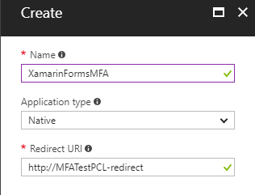

"Redirect URI" is any valid URI identifier (you don't need to register it with DNS) - it is important that you client app configuration uses the same.

4. Change returnUri in [MainPage.xaml.cs](MFATest/MFATest/MainPage.xaml.cs#L15) to valid URI you have configured in the previous step in Azure Active Directory App Registration or use existing one from this sample (ensure you configure the same in the previous step):

```csharp
public static string returnUri = "http://MFATestPCL-redirect";`
```

5. Now you have your app registered: 

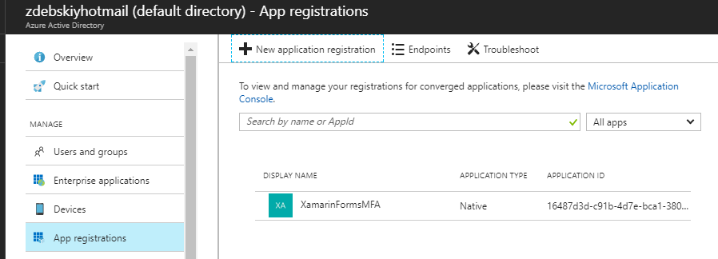

click on it to go to this new app details and settings and copy Application ID.

6. Insert this Application ID (often referred also as Client ID) into [MainPage.xaml.cs](MFATest/MFATest/MainPage.xaml.cs#L13)

```csharp
public static string clientId = "<<INSERT YOUR CLIENT ID HERE>>";`
```

7. Now let's create user (or jump to the next if you already have it) - go again to "Azure Active Directory" blade (section), click "Users and Groups", then - "All users" and finally "New User"

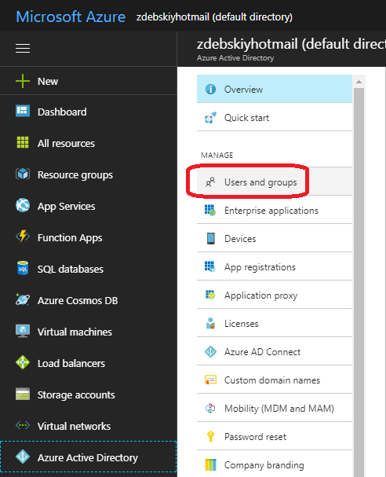
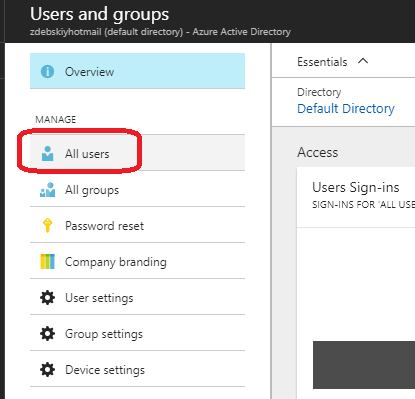
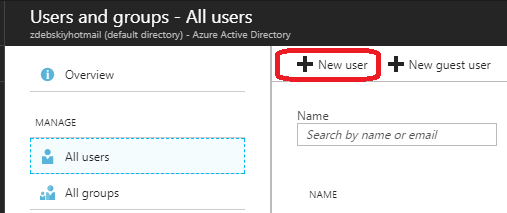

When filling out new user information pay attention to user name. In case you have corporate domain like 'companyname.com' use it after '@'. In case you have personal subscription - domain name could be auto generated - take a look at the top left bar - here you see auto-generated domain name. Add it after '@' and then use '.onmicrosoft.com' domain suffix - this is pattern for auto generated Azure Active Directory Domain (Tenant) names. Additionally go to profile section and give a user first and last name. Also pay attention to user password:

 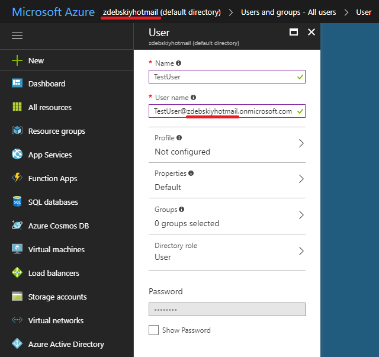   

 click "Create" and now you have user.

8. Ensure new user appeared in the list and click "Multi-Factor Authentication":

 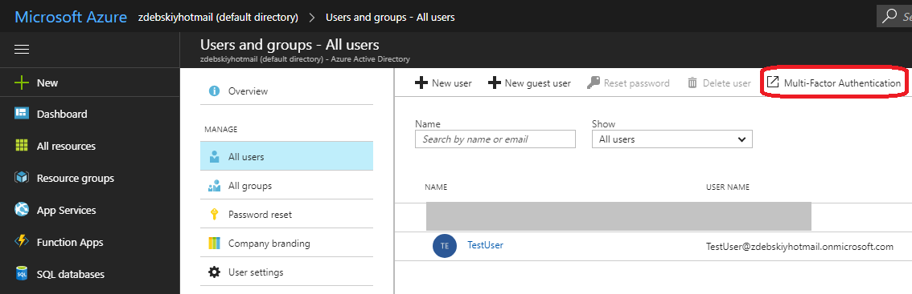 

9. Select user with checkbox and click "Enable"

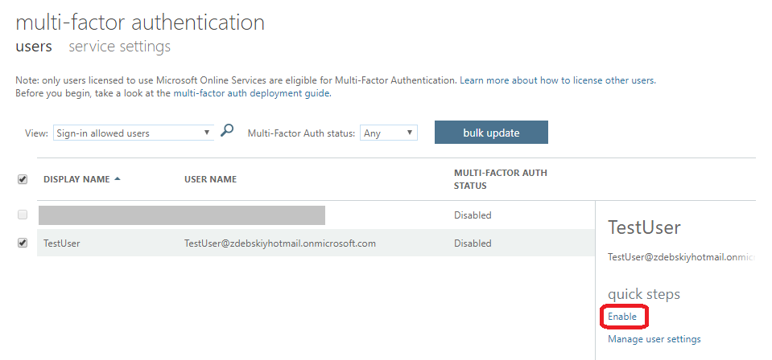 

You should get the following message:

  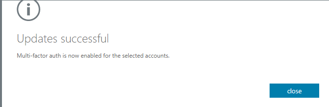  

10. Run the sample - screenshots on how it works:

# iOS:

<p align="center">
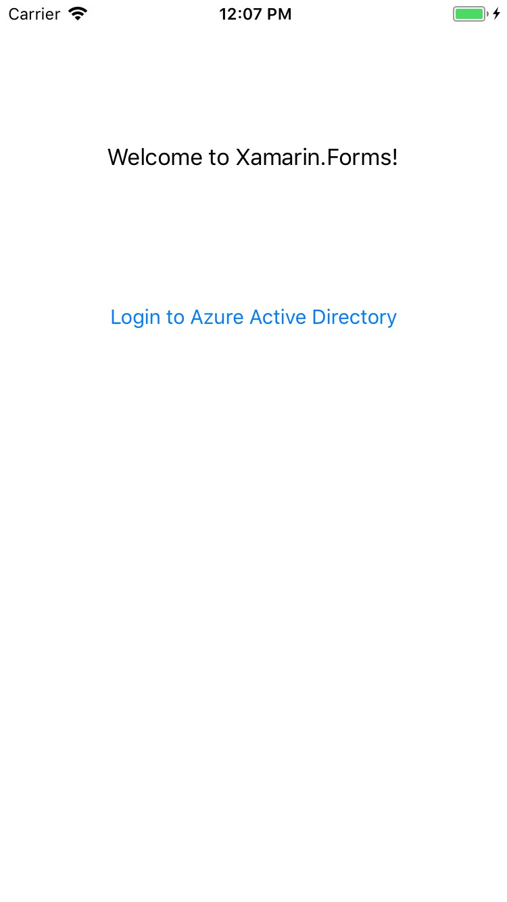
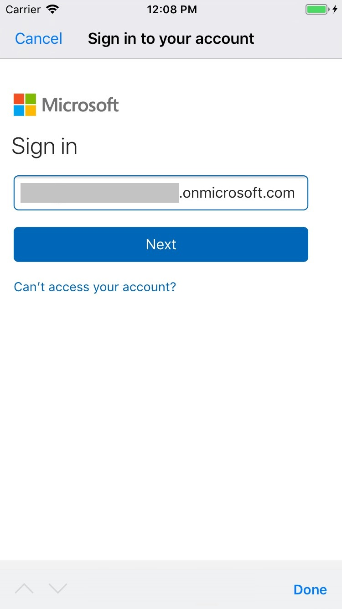
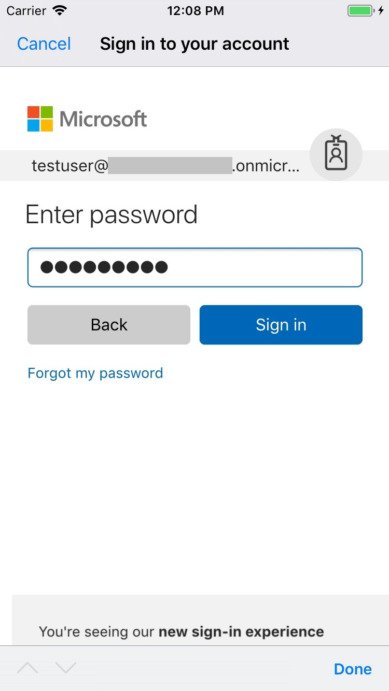
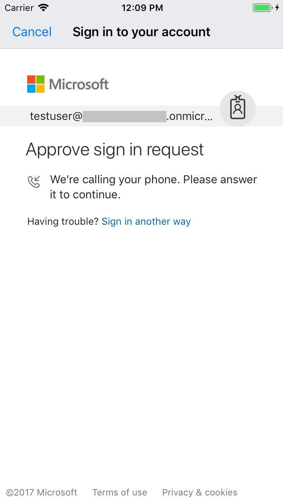
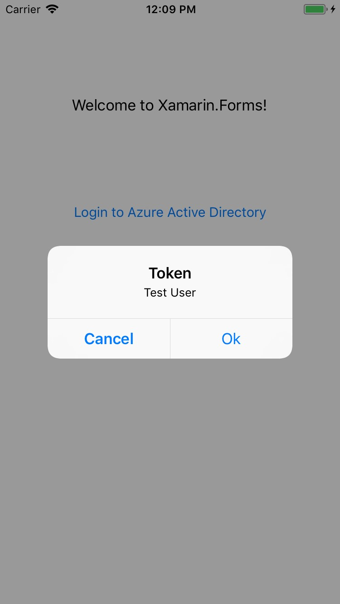
</p>

# Android:

<p align="center">
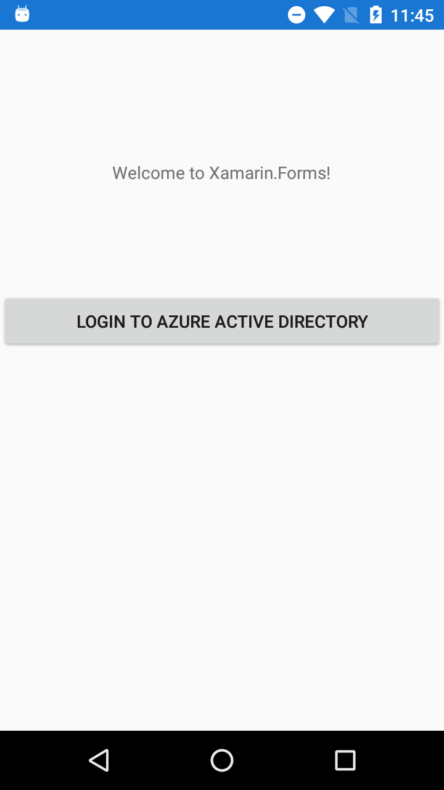
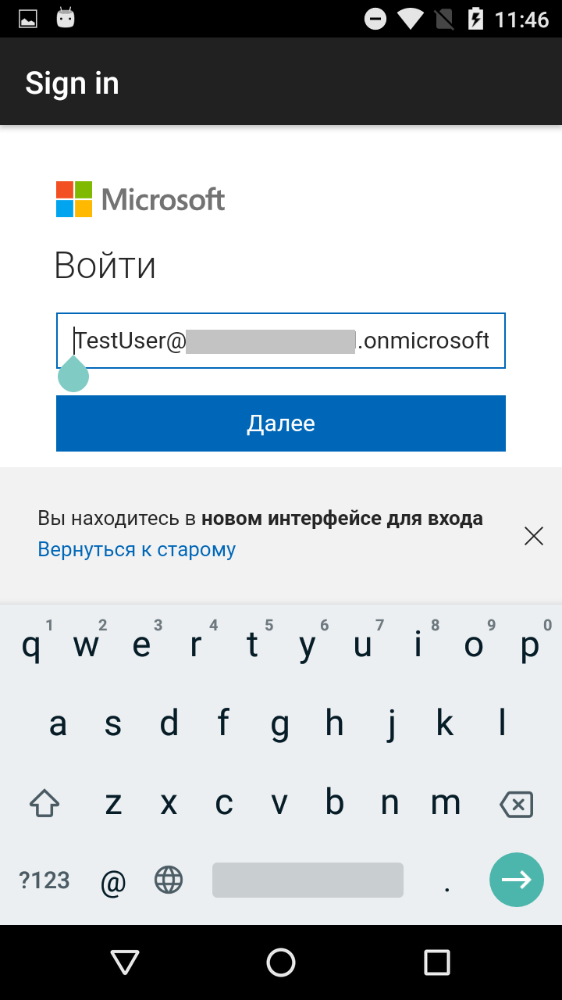
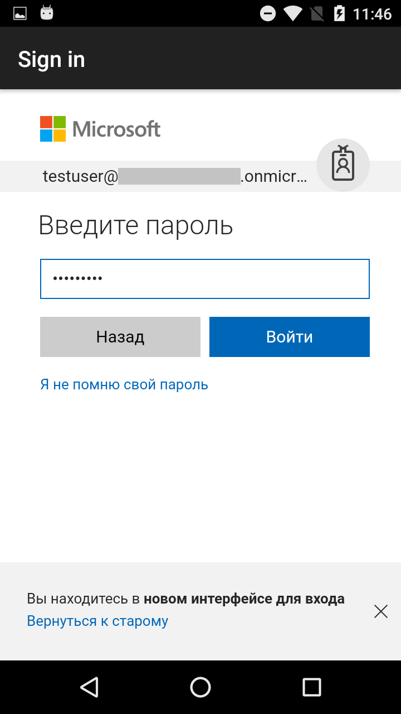
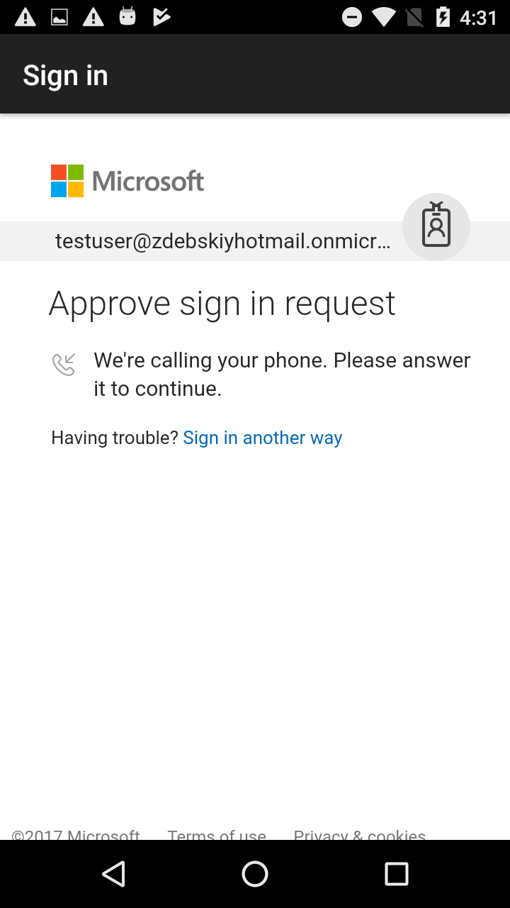
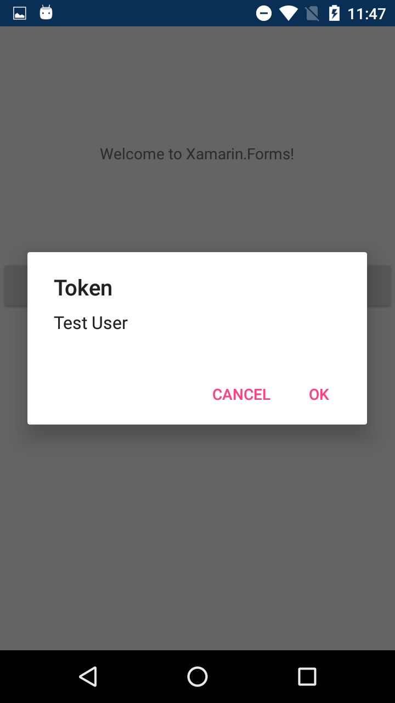
</p>

# Useful notes, links and resources:
* To have Multi-Factor Authentication functionality available for your account you need to activate [Azure Active Directory Premium free trial](https://azure.microsoft.com/en-us/trial/get-started-active-directory/) or purchase [Azure Active Directory Premium](https://docs.microsoft.com/en-us/azure/active-directory/active-directory-get-started-premium)/[Enterprise Mobility + Security](https://www.microsoft.com/en-us/cloud-platform/enterprise-mobility-security). 
* How to create Azure Active Directory [tenant and test user with enabled multi-factor authentication](https://docs.microsoft.com/en-us/rest/api/datacatalog/create-an-azure-active-directory-tenant).
* [Authenticate Xamarin Mobile Apps Using Azure Active Directory](https://blog.xamarin.com/authenticate-xamarin-mobile-apps-using-azure-active-directory/).
